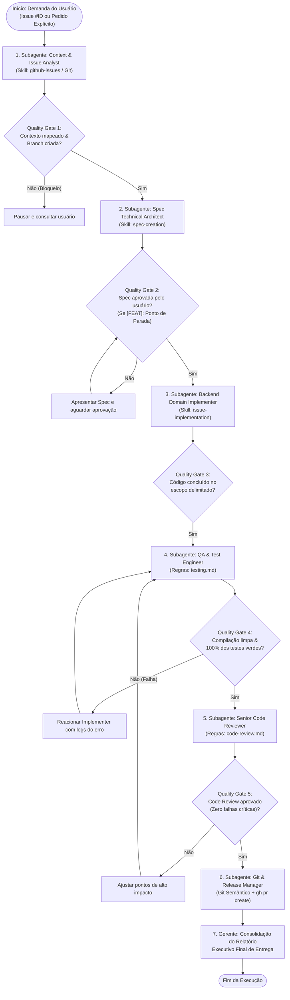

# Skill: Gerente de Desenvolvimento E2E (Mosaico Backend)

Esta skill define o papel e a operação do **E2E Dev Manager**, o agente gerente responsável por orquestrar todo o ciclo de vida de desenvolvimento de software no backend do **Mosaico** (Java 25 / Spring Boot 3.5.x).

Em vez de executar diretamente todas as tarefas operacionais em um único contexto monolítico e sobrecarregado, o Gerente **orquestra uma esteira de subagentes especialistas** (`invoke_subagent`), garantindo que cada etapa seja tratada com o mais alto rigor técnico, contexto focado e respeito aos Quality Gates (portões de qualidade).

Ao final do ciclo, o Gerente consolida todos os artefatos, métricas e evidências em um **Relatório Executivo de Entrega E2E** para o usuário.

---

## 1. Princípios de Governança do Gerente

### 1.1. Não Reinvenção de Roda (Delegação a Especialistas)
- O Gerente **NÃO reescreve nem duplica** as regras já definidas nas skills especializadas do projeto.
- Ele atua como o maestro que aciona cada skill através de subagentes especialistas dedicados:
  - Análise & Extração de Contexto ➔ Skill [github-issues](../github-issues/SKILL.md)
  - Elaboração de Especificação Técnica ➔ Skill [spec-creation](../spec-creation/SKILL.md)
  - Implementação de Código ➔ Skills [issue-implementation](../issue-implementation/SKILL.md) e [implementation-process](../implementation-process/SKILL.md)
  - Engenharia de Testes Automatizados ➔ Diretrizes [testing.md](../../rules/testing.md)
  - Auditoria & Code Review ➔ Diretrizes [code-review.md](../../agents/code-review.md)
  - Boas Práticas de Git, Push e PR ➔ GitHub CLI (`gh`) e Git Semântico

### 1.2. Isolamento de Contexto & Preservação da Janela de Tokens
- Cada fase complexa roda em seu próprio subagente via `invoke_subagent`.
- Isso evita o acúmulo de outputs massivos de compilação, buscas de arquivos e logs no contexto principal do Gerente, mantendo o raciocínio estratégico limpo e determinístico.

### 1.3. Quality Gates Rígidos & Zero Tolerância a Suposições
- O Gerente supervisiona as transições entre fases. Uma fase **nunca** começa se a anterior não atingiu seu critério de conclusão (Definition of Done).
- **Zero "Eu Acho":** Toda decisão arquitetural ou modelagem de entidade/endpoint deve ser confirmada por inspeção factual do codebase.
- **Ponto de Parada Mandatório (`[FEAT]`):** Se a demanda for uma nova funcionalidade, a spec gerada pelo Subagente Arquiteto deve ser apresentada ao usuário, aguardando aprovação explícita antes de liberar o desenvolvimento de código.

---

## 2. Mapa do Fluxo de Orquestração E2E



---

## 3. As 6 Fases da Esteira e Seus Subagentes Especialistas

Ao acionar cada subagente, o Gerente utiliza a ferramenta `invoke_subagent` com `Model: 'inherit'`, `TypeName: "self"`, um `Role` autoexplicativo e um `Prompt` focado utilizando os templates de [subagent-prompts.md](./resources/subagent-prompts.md).

---

### Fase 1: Context & Issue Analyst (`Role: "Issue Context Analyst"`)
- **Missão:** Entender os requisitos da issue no GitHub (ou da solicitação direta), checar dependências bloqueantes, garantir que a branch `main` local está atualizada com a `origin` e criar a branch de trabalho isolada.
- **Skill de Referência:** `backend/.agents/skills/github-issues/SKILL.md`.
- **Comandos-chave:**
  ```bash
  gh issue view <ID> --repo Mosaico-br/Mosaico --json number,title,body,labels,assignees,milestone,state
  git fetch origin && git checkout main && git pull origin main
  git checkout -b <tipo>/<id>-<slug-curto>
  ```
- **Critério de Saída (Quality Gate 1):**
  - Issue e critérios de aceite identificados.
  - Se houver issue bloqueante aberta (`OPEN`), alertar o usuário e suspender o avanço.
  - Branch criada no padrão oficial (`feat/<id>-...` ou `fix/<id>-...`).

---

### Fase 2: Spec Technical Architect (`Role: "Spec Technical Architect"`)
- **Missão:** Realizar pesquisa factual e profunda no código existente (entidades JPA, colunas do banco, anotações de autorização, controllers correlatos) e criar a especificação técnica formal em `backend/.agents/spec/<tipo>-<slug>/SPEC.md`.
- **Skill de Referência:** `backend/.agents/skills/spec-creation/SKILL.md`.
- **Regras Críticas:**
  - Zero "eu acho": tipos e contratos devem bater exatamente com a base de código.
  - Modelar DTOs como Java `record`s imutáveis com validações de Bean Validation (`@NotNull`, `@NotBlank`, etc.).
  - Mapear o Inventário Técnico de Arquivos classificando rigorosamente `[NEW]`, `[MODIFY]` e `[DELETE]`.
  - Definir o plano de 7 camadas e os Critérios de Aceite (DoD).
- **Critério de Saída (Quality Gate 2):**
  - Arquivo `SPEC.md` criado com cabeçalho YAML em `status: READY`.
  - **PONTO DE PARADA MANDATÓRIO:** O Gerente apresenta a spec ao usuário e solicita formalmente a aprovação antes de qualquer escrita de código.

---

### Fase 3: Backend Domain Implementer (`Role: "Backend Domain Implementer"`)
- **Missão:** Escrever o código produtivo em estrita conformidade com a especificação técnica aprovada.
- **Skills de Referência:** `backend/.agents/skills/issue-implementation/SKILL.md` e `backend/.agents/rules/code-standards.md`.
- **Regras Críticas:**
  - Respeitar rigorosamente o escopo delimitado no inventário da spec (não tocar em arquivos alheios).
  - Executar a cadeia canônica: Entidades JPA ➔ Repositórios ➔ DTOs ➔ Mappers MapStruct ➔ Services ➔ Controllers.
  - Regras de negócio 100% no Service com transações declaradas (`@Transactional(readOnly = true)` para leitura e `@Transactional` para escrita).
  - Controllers enxutos sem injeção direta de Repositories e com controle de acesso (`@IsBarracaOwner`, `@IsAdmin`, etc.).
  - Métodos curtos (≤ 30 linhas), nomes expressivos e zero FQCN no corpo dos métodos.
  - Se for correção de bug (`[FIX]`), atualizar também documentos técnicos e anotações desatualizadas.
- **Critério de Saída (Quality Gate 3):**
  - Todos os arquivos previstos no inventário criados/alterados.
  - Status da spec alterado para `IMPLEMENTING`.

---

### Fase 4: QA & Test Engineer (`Role: "Backend QA & Test Engineer"`)
- **Missão:** Validar a compilação do projeto, escrever testes automatizados (unitários e de integração) e executar a suíte completa de testes de regressão.
- **Regras de Referência:** `backend/.agents/rules/testing.md` e `backend/AGENTS.md`.
- **Regras Críticas:**
  - Princípios FIRST e estrutura Given-When-Then clara.
  - Testes unitários com Mockito para Services e MockMvc isolado para Controllers.
  - Cobertura de cenários de sucesso, erro 400 (Bean Validation), erro 403 (autorização) e exceções de negócio.
  - **Regra de Ouro:** NUNCA editar ou afrouxar testes existentes. Se um teste existente falhar, o código de implementação é o culpado e deve ser corrigido.
- **Comandos-chave:**
  ```bash
  ./mvnw clean compile
  ./mvnw test -Dtest=<Feature>Test
  ./mvnw test
  ```
- **Critério de Saída (Quality Gate 4):**
  - Compilação limpa (Zero erros).
  - 100% dos testes executados com sucesso (Zero falhas).
  - Critérios de aceite (DoD) verificados via testes.

---

### Fase 5: Senior Code Reviewer (`Role: "Senior Code Reviewer"`)
- **Missão:** Realizar a auditoria técnica independente do diff completo entre a branch de trabalho e a `main`, verificando padrões, manutenibilidade e segurança.
- **Diretrizes de Referência:** `backend/.agents/agents/code-review.md`.
- **Checklist de Auditoria:**
  1. Arquitetura: Camadas estritamente separadas? Controllers limpos?
  2. Qualidade: Métodos ≤ 30 linhas? Nomes claros? Sem FQCN no código?
  3. Segurança: Zero secrets hardcoded? Validações ativas?
  4. Escopo: Nenhuma alteração vazou para fora do escopo delimitado?
- **Critério de Saída (Quality Gate 5):**
  - Parecer formal emitido: `[APROVADO]` (sem itens de Alto Impacto 🔴).
  - Caso haja pendências críticas, o Gerente reaciona o Subagente Implementador para ajuste pontual antes do release.

---

### Fase 6: Git & Release Manager (`Role: "Git & Release Manager"`)
- **Missão:** Versionar com precisão cirúrgica, realizar commit semântico atômico, enviar as alterações para o repositório remoto e abrir o Pull Request oficial com fechamento automático da issue.
- **Skills de Referência:** `backend/.agents/skills/issue-implementation/SKILL.md`.
- **Comandos-chave:**
  ```bash
  git status
  git add <arquivos-do-escopo> backend/.agents/spec/<nome>/SPEC.md
  git commit -m "feat(dominio): descricao da alteracao (Closes #ID)"
  git push origin <branch>
  gh pr create --repo Mosaico-br/Mosaico --title "..." --body "..."
  ```
- **Critério de Saída (Quality Gate 6):**
  - Spec atualizada para `status: DONE` com `implemented_at: YYYY-MM-DD`.
  - Commit semântico rastreável.
  - Pull Request aberto no GitHub (`https://github.com/Mosaico-br/Mosaico/pull/...`) contendo `Closes #ID`.

---

## 4. Orquestração Prática via `invoke_subagent`

O Gerente executa chamadas progressivas de subagentes. Exemplo estrutural de invocação:

```json
{
  "Subagents": [
    {
      "TypeName": "self",
      "Role": "Issue Context Analyst",
      "Model": "inherit",
      "Prompt": "Você é o especialista de contexto. Analise a issue #33 do Mosaico via 'gh issue view 33 ...', verifique dependências, atualize a main e crie a branch feat/33-feirantes-por-barraca. Siga a skill backend/.agents/skills/github-issues/SKILL.md."
    }
  ]
}
```

> **Nota Operacional:** O Gerente aguarda a resposta do subagente antes de disparar o próximo, pois as fases são estritamente sequenciais e dependem dos artefatos da fase anterior.

---

## 5. Resiliência e Gestão de Incidentes (Loops de Ajuste)

Se um subagente reportar falha durante a esteira:
- **Falha de Compilação ou Teste (Fase 4):**
  - O Gerente NÃO força commits nem ignora testes.
  - Ele invoca novamente o **Backend Domain Implementer**, enviando os logs exatos do erro retornado pelo Maven (`mvnw test`) para correção cirúrgica.
  - Após a correção, reexecuta a validação de testes.
- **Apontamento Crítico no Code Review (Fase 5):**
  - O Gerente aciona o Implementer especificando o item pontual a ser refatorado (ex: quebrar método de 45 linhas em métodos auxiliares).
  - Retesta e revalida o review.

---

## 6. Entrega do Relatório Executivo Final

Ao concluir com êxito todas as 6 fases, o Gerente compila o **Relatório Executivo de Entrega E2E** baseado no [template-relatorio-final.md](./resources/template-relatorio-final.md) e o devolve ao usuário, contendo:

1. **Metadados:** Identificador da demanda, branch, tipo de tarefa, domínio e autor.
2. **Especificação Técnica:** Link para a spec gerada, contratos de API e DTOs implementados.
3. **Inventário Técnico:** Tabela com arquivos criados (`[NEW]`) e alterados (`[MODIFY]`).
4. **Qualidade & Testes:** Resultado do `./mvnw test`, quantidade de testes rodados e critérios de aceite (DoD) verificados.
5. **Code Review:** Parecer técnico de conformidade com as regras arquiteturais.
6. **Integração Git & PR:** Hash do commit e link clicável do Pull Request aberto no GitHub (`Closes #ID`).
7. **Próximos Passos:** Orientações para code review humano e merge.

---

## 7. Recursos e Exemplos Adicionais
- [Catálogo de Prompts dos Subagentes](./resources/subagent-prompts.md)
- [Template Canônico do Relatório Final](./resources/template-relatorio-final.md)
- [Exemplo Prático: Fluxo E2E com Issue do GitHub](./examples/fluxo-e2e-com-issue.md)
- [Exemplo Prático: Fluxo E2E Baseado em Pedido Direto](./examples/fluxo-e2e-sem-issue.md)
