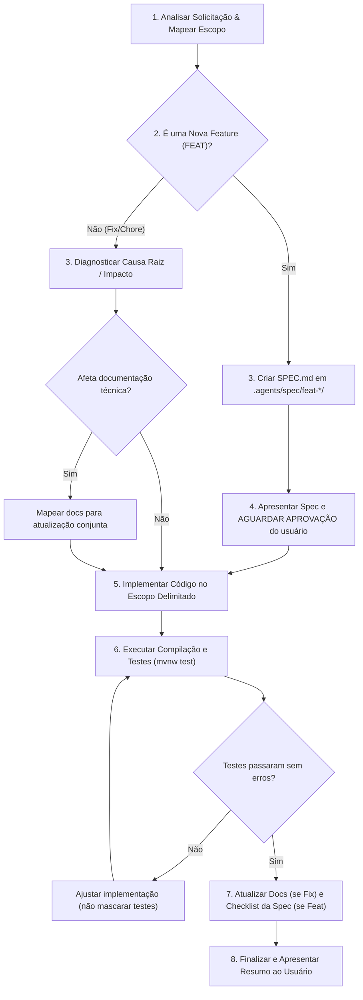

# Skill: Processo Canônico de Implementação (Mosaico Backend)

Esta skill define o processo obrigatório para conduzir qualquer desenvolvimento, melhoria, refatoração ou correção solicitada diretamente pelo usuário (demandas avulsas sem uma GitHub Issue vinculada).

> **Nota:** Caso a demanda esteja vinculada a um ticket aberto no GitHub (ex: "resolva a issue #33"), utilize prioritariamente a skill `issue-implementation`.

---

## 1. Regras de Ouro e Diretrizes Inegociáveis

### 1.1. Zero "Eu Acho" — Proibição de Desenvolvimento por Suposição
- **É terminantemente proibido partir de um "eu acho" para desenvolver.**
- Nenhuma decisão de arquitetura, modelagem de banco ou endpoint deve se basear em suposições.
- Toda alteração deve ser fundamentada na leitura factual do código existente (`AGENTS.md`, entidades, DTOs e serviços já em produção).

### 1.2. Spec Obrigatória + Ponto de Parada para Aprovação (`[FEAT]`)
- Para qualquer nova funcionalidade ou adição de regras de negócio (`feat`):
  1. **Nenhum desenvolvimento deve iniciar sem uma spec técnica criada.** Crie a especificação em `.agents/spec/feat-<nome>/SPEC.md` utilizando a estrutura da skill `spec-creation`.
  2. **Ponto de Parada Mandatório:** O agente deve apresentar um resumo da spec com os contratos propostos e **PARAR para aguardar a aprovação explícita do usuário**.
  3. **SOMENTE após a leitura e aprovação formal da spec pelo usuário**, a implementação de código pode ser iniciada. Isso elimina retrabalho e desalinhamento de expectativas.

### 1.3. Diagnóstico de Causa Raiz + Atualização de Documentação (`[FIX]`)
- Para correções de bugs e defeitos (`fix`):
  1. Identifique e comprove a causa raiz do problema no código antes de realizar alterações.
  2. Verifique se o defeito impacta documentações técnicas existentes (`docs/`, `AGENTS.md`, ADRs em `.agents/adr/`, schemas OpenAPI/Swagger).
  3. **Toda correção que altere comportamento documentado DEVE atualizar a respectiva documentação técnica no mesmo escopo da alteração.**

### 1.4. Exceção para Desenvolvimento Direto
- O desenvolvimento direto (sem criação prévia de spec) **só é permitido quando o usuário solicitar explicitamente**.
- Exemplos de autorização explícita:
  - *"implemente diretamente"*
  - *"não crie spec"*
  - *"faça direto sem spec"*
- Mesmo nesta exceção, a regra de **zero "eu acho"** permanece ativa: baseie-se exclusivamente no código real.

---

## 2. Fluxo Operacional Passo a Passo



---

### Passo 1: Análise de Impacto e Delimitação de Escopo
Antes de editar qualquer arquivo:
1. Mapeie os domínios de negócio afetados (ex: `auth`, `feira`, `barraca`, `order`, etc.).
2. Identifique os arquivos específicos que serão modificados ou criados.
3. Delimite a fronteira da alteração para evitar trabalho concorrente em múltiplos módulos ou sobreposição entre frontend e backend.

### Passo 2: Planejamento & Elaboração da Spec (quando `[FEAT]`)
1. Crie o arquivo `.agents/spec/feat-<nome-da-feature>/SPEC.md`.
2. O arquivo deve conter:
   - **Cabeçalho YAML:** `name`, `description`, `type: feat`, `status: DRAFT`, `created_at`.
   - **Contexto e Problema:** A necessidade real de negócio que motiva a mudança.
   - **Arquivos Afetados:** Lista exata de controllers, services, repositories e DTOs.
   - **Contratos e DTOs Reais:** Payloads de entrada e saída modelados como Java `record`s baseados no padrão do projeto.
   - **Plano de Implementação:** Passos sequenciais de desenvolvimento.
   - **Critérios de Aceite:** Checklist objetivo (`- [ ]`).

### Passo 3: Ponto de Parada e Solicitação de Aprovação
Apresente ao usuário:
> *"Criei a especificação técnica em `.agents/spec/feat-<nome>/SPEC.md`. Ela detalha os contratos, arquivos impactados e o plano de passos. Por favor, revise a spec. Posso iniciar a implementação?"*

**PARE E AGUARDE.** Não escreva código produtivo antes da confirmação do usuário.

### Passo 4: Implementação de Código
Durante a codificação, siga rigorosamente as diretrizes arquiteturais do Mosaico (`AGENTS.md`):
- **Services:**
  - Concentram 100% das regras de negócio.
  - Anotações transacionais obrigatórias: `@Transactional(readOnly = true)` para métodos de consulta e `@Transactional` para métodos de escrita.
  - **Parâmetros limpos:** Os métodos de Service devem preferencialmente receber a entidade ou o DTO completo (ex: `EmailVerificationRequest`, `BarracaCreateRequest`) em vez de múltiplos parâmetros primitivos desestruturados.
- **DTOs:**
  - Devem ser Java `record`s imutáveis com anotações de validação (`@NotNull`, `@NotBlank`, `@Email`, etc.).
  - Nunca exponha entidades JPA diretamente nos retornos de Controllers.
- **Mappers:**
  - Utilize interfaces MapStruct (`@Mapper(componentModel = "spring")`) para conversão entre DTOs e entidades.
- **Controllers:**
  - Devem ser finos e objetivos. Apenas recebem a requisição, validam com `@Valid`, aplicam anotações de segurança e delegam ao Service.
  - **NUNCA injete Repositories diretamente em Controllers.**
- **Segurança e Ownership:**
  - Aplique as anotações customizadas de segurança (`@IsBarracaOwner`, `@IsAdmin`, `@IsOrderOwner`, etc.) para garantir que nenhum usuário manipule recursos de terceiros.

### Passo 5: Atualização de Documentação Técnica (quando `[FIX]`)
Se a tarefa for uma correção de bug que alterou comportamento prévio documentado:
- Atualize a documentação técnica correspondente (arquivos em `docs/`, `AGENTS.md`, ADRs ou anotações Swagger/OpenAPI) no mesmo conjunto de alterações.
- Garanta que a documentação reflita a verdade atual do sistema após a correção.

### Passo 6: Validação Rigorosa e Execução de Testes
A tarefa só é considerada concluída após passar por validação automatizada:
1. **Compilação limpa:**
   ```bash
   ./mvnw clean compile
   ```
2. **Execução de testes da funcionalidade:**
   ```bash
   ./mvnw test -Dtest=<Feature>ServiceTest
   ```
3. **Execução da suíte completa de testes:**
   ```bash
   ./mvnw test
   ```
> **Regra de Testes:** Em caso de falha de testes existentes, investigue e ajuste o código do serviço implementado. **Evite alterar testes existentes**, a menos que o teste em si esteja comprovadamente incorreto devido a uma mudança intencional de contrato já aprovada na spec.

### Passo 7: Checklist Final de Conclusão
Antes de reportar a conclusão ao usuário, valide se:
- [ ] O código segue estritamente os padrões existentes do projeto sem inventar convenções.
- [ ] Nenhuma alteração foi feita fora do escopo delimitado.
- [ ] Componentes, utilitários e serviços existentes foram reaproveitados.
- [ ] Se `[FEAT]`: Checklist da spec técnica está completo e o status foi alterado para `DONE`.
- [ ] Se `[FIX]`: Documentações técnicas impactadas foram devidamente atualizadas.
- [ ] Compilação e suíte de testes (`./mvnw test`) executam com 100% de sucesso.
- [ ] Código limpo, sem imports não utilizados ou comentários de debug desnecessários.