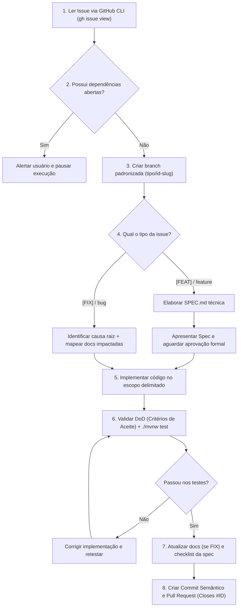

# Skill: Implementação de Issues do GitHub (Mosaico)

Esta skill define o fluxo operacional e de engenharia obrigatório para resolver e implementar issues existentes no repositório `Mosaico-br/Mosaico`.

---

## 1. Regras de Ouro e Diretrizes Inegociáveis

### 1.1. Zero "Eu Acho" — Proibição de Desenvolvimento Baseado em Suposições
- **NUNCA parta de suposições ("eu acho que deve ser assim") para implementar qualquer alteração.**
- Todo desenvolvimento deve ser fundamentado na análise factual do codebase existente, contratos reais da arquitetura e especificações documentadas.

### 1.2. Spec Obrigatória Antes de Codificar qualquer `[FEAT]`
- Para qualquer issue de nova funcionalidade (`[FEAT]` ou label `feature`):
  1. É **estritamente obrigatório** criar uma nova especificação técnica em `.agents/spec/feat-<nome>/SPEC.md` (seguindo a skill `spec-creation`) antes de escrever qualquer linha de código produtivo.
  2. **Ponto de Parada Mandatório:** O agente deve apresentar a spec e **AGUARDAR a aprovação explícita do usuário**.
  3. **SOMENTE após a leitura e aprovação formal da spec pelo usuário**, a implementação de código pode ser iniciada. Isso elimina retrabalho e desalinhamentos de arquitetura.

### 1.3. Atualização de Documentação Obrigatória para `[FIX]`
- Para issues de correção de defeito (`[FIX]` ou label `bug`):
  1. Identifique e comprove a causa raiz do problema antes de alterar o código.
  2. Verifique se existem documentações técnicas associadas (arquivos em `docs/`, `AGENTS.md`, ADRs, schemas de OpenAPI/Swagger ou endpoints documentados) que descreviam o comportamento antigo com defeito.
  3. **Toda correção de bug que altere comportamento documentado DEVE atualizar a respectiva documentação técnica** no mesmo escopo da issue.

### 1.4. Respeito Estrito ao Escopo Delimitado
- Modifique **exclusivamente** os arquivos, pacotes e componentes declarados na seção `### Escopo e Domínios/Arquivos Afetados` da issue e da spec.
- É terminantemente proibido tocar em outros domínios ou misturar alterações de frontend e backend em uma mesma execução para evitar colisões e concorrência entre agentes/desenvolvedores.

---

## 2. Fluxo Operacional de Execução (Passo a Passo)



---

### Passo 1: Leitura e Inspeção da Issue no GitHub

Obtenha todos os metadados da issue via GitHub CLI (`gh`):

```bash
gh issue view <ID> --repo Mosaico-br/Mosaico --json number,title,body,labels,assignees,milestone,state
```

Analise e extraia:
- **Título e Tipo:** Verificar se é `[FEAT]`, `[FIX]`, `[CHORE]`, etc.
- **Contexto e Problema:** Compreender a dor e o objetivo exato.
- **Dependências:** Verificar a seção `### Dependências`.
- **Arquivos e Domínios Afetados:** Delimitar o raio de atuação.
- **Contratos e DTOs:** Verificar payloads e interfaces exigidas.
- **Critérios de Aceite (DoD):** Mapear os itens da checklist para validação posterior.

---

### Passo 2: Verificação de Dependências e Bloqueios

Se a issue listar dependências (ex: `Depende de: #12`):
1. Verifique o status da dependência:
   ```bash
   gh issue view 12 --repo Mosaico-br/Mosaico --json state,title
   ```
2. **Se a dependência ainda estiver `OPEN`:**
   - **PARE imediatamente.**
   - Notifique o usuário: *"A issue #X depende da issue #12 que ainda se encontra ABERTA. Deseja resolver a issue #12 primeiro ou prosseguir mesmo assim?"*
   - Aguarde orientação expressa antes de continuar.

---

### Passo 3: Criação de Branch Padronizada

1. Garanta que a base local está sincronizada:
   ```bash
   git fetch origin
   git checkout main
   git pull origin main
   ```
2. Crie e alterne para a branch de trabalho seguindo o padrão:
   - Para feature: `git checkout -b feat/<ID>-<descricao-curta>`
   - Para fix: `git checkout -b fix/<ID>-<descricao-curta>`
   - Para chore/refactor: `git checkout -b chore/<ID>-<descricao-curta>`

*Exemplo:* `git checkout -b feat/33-api-lojista`

---

### Passo 4: Elaboração da Spec Técnica (Obrigatório para `[FEAT]`)

1. Crie o diretório da spec:
   ```text
   backend/.agents/spec/feat-<nome-curto-da-issue>/SPEC.md
   ```
2. Estruture a spec conectando-a formalmente à issue:
   ```markdown
   ---
   name: [NOME DA SPEC]
   description: [DESCRIÇÃO CURTA]
   type: feat
   status: DRAFT
   issue: "#<ID>"
   created_at: [DATA ATUAL]
   ---

   # Spec: [NOME DA SPEC] (Issue #<ID>)

   ## Contexto e Problema
   (Espelha e detalha o contexto da issue)

   ## Arquivos e Domínios Afetados
   (Lista rigorosa dos arquivos de controller, service, repository, dto e testes)

   ## Contratos e DTOs
   (Modelagem real com records Java e anotações @NotNull, etc.)

   ## Plano de Implementação Ordenado
   1. Criar/atualizar DTOs
   2. Atualizar/criar Repository
   3. Implementar regras de negócio no Service com @Transactional
   4. Criar Controller enxuto com anotações de segurança
   5. Escrever testes unitários e de integração

   ## Critérios de Aceite
   (Espelha todos os itens da checklist da issue)
   ```
3. **PONTO DE PARADA:** Apresente a spec ao usuário e solicite:
   > *"Spec criada em `backend/.agents/spec/.../SPEC.md`. Por favor, revise os contratos e o plano técnico. Posso prosseguir com a implementação?"*
4. **NÃO escreva código antes da confirmação do usuário.**

---

### Passo 5: Diagnóstico e Mapeamento de Docs (Obrigatório para `[FIX]`)

1. Localize a linha/método causador do erro utilizando `grep_search` e `view_file`.
2. Se houver divergência entre o comportamento documentado e o comportamento corrigido, localize os arquivos em `docs/` ou `AGENTS.md`.
3. Planeje a correção do código e a respectiva atualização dos arquivos de documentação em conjunto.

---

### Passo 6: Implementação Estrita no Escopo

1. Siga o plano aprovado na spec ou o escopo do fix.
2. Respeite as boas práticas do `AGENTS.md`:
   - DTOs como Java `record`s imutáveis com `@Valid`.
   - Mappers com MapStruct (`@Mapper(componentModel = "spring")`).
   - Lógica 100% no Service com `@Transactional`.
   - Controllers enxutos sem injeção direta de Repositories.
   - Regras de segurança de acesso (`@IsBarracaOwner`, `@IsAdmin`, etc.).
3. **Não altere arquivos fora do escopo da issue.**

---

### Passo 7: Validação Rigorosa contra o DoD e Testes

1. Execute a compilação do projeto para garantir sanidade de tipos e sintaxe:
   ```bash
   ./mvnw clean compile
   ```
2. Execute a classe de testes da feature/fix:
   ```bash
   ./mvnw test -Dtest=<Feature>ServiceTest
   ```
3. Execute a suíte completa de testes para garantir que não há regressões:
   ```bash
   ./mvnw test
   ```
4. Verifique individualmente cada critério da seção `### Critérios de Aceite (Definition of Done)` da issue e marque-os como validados.
5. Se for uma `[FEAT]`, atualize o status da spec para `DONE` e marque o checklist final da spec.

---

### Passo 8: Finalização, Commit Semântico e Pull Request

1. Verifique o status das alterações:
   ```bash
   git status
   ```
2. Adicione os arquivos do escopo e realize o commit semântico:
   ```bash
   git add <arquivos-alterados>
   git commit -m "feat(dominio): breve descricao da solucao (Closes #<ID>)"
   ```
3. Envie a branch para o repositório remoto:
   ```bash
   git push origin feat/<ID>-<descricao-curta>
   ```
4. Crie o Pull Request com fechamento automático da issue:
   ```bash
   gh pr create \
     --repo Mosaico-br/Mosaico \
     --title "[FEAT] - <Titulo da Issue>" \
     --body "Resolve a issue #<ID>.

   ### O que foi feito
   - Implementacao conforme especificado na issue #<ID> e na spec tecnica vinculada.
   - Validacao de criterios de aceite (DoD) concluida.
   - Testes unitarios e de integracao executados com sucesso.

   Closes #<ID>"
   ```
5. Apresente o link do PR e o resumo da entrega ao usuário.

---

## 3. Recursos e Checklist Rápido
- [Checklist Operacional de Execução](./resources/checklist-execucao.md)
- [Exemplo Completo de Resolução de Issue](./examples/fluxo-resolucao-issue-feat.md)
